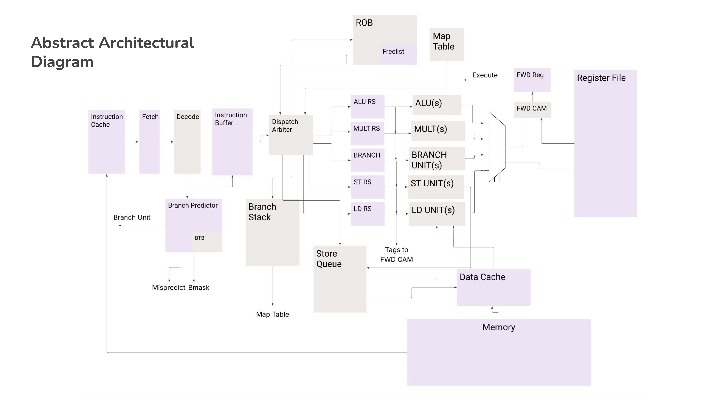

# Out-of-Order N-Way Superscalar MIPS Processor

This project implements an out-of-order, superscalar MIPS processor with inspiration taken from the MIPS R10K architecture. The design focuses on maximizing instruction-level parallelism while managing complexity through deliberate architectural tradeoffs. This processor was developed as the Capstone project in EECS 470, a Computer Architecture course at the University of Michigan. This project emphasizes advanced microarchitectural features and the importance of performance analysis, and robust testing.

## Source Code Availability

The full codebase for this processor is kept private due to academic integrity requirements. Recruiters and reviewers may request access by contacting me directly at [jcollis.dev@gmail.com](mailto:jcollis.dev@gmail.com)

## High-Level Architecture

At a system level, the processor follows a register-renaming, ROB-based out-of-order design modeled after the R10K. It avoids repeated wide data broadcasts by relying on tag-based dependency resolution and centralized arbitration. A full system block diagram is included in the `diagrams/` directory.

Key components include:
- Reorder Buffer (ROB) for in-order retirement
- Physical register file with map table and free list
- Split reservation stations by functional unit type
- Centralized N-way Common Data Bus (CDB)
- Store queue with load forwarding
- Branch stack for early branch resolution

## Advanced Features

### N-Way Superscalar Execution
The processor supports a parameterizable superscalar width (tested up to 5-way). Dispatch, issue, and CDB bandwidth scale with this width. Performance evaluation showed diminishing returns beyond 2-way execution due to instruction fetch and cache limitations, leading to a final 2-way configuration.

### Early Tag Broadcast (ETB)
Early Tag Broadcast enables dependent instructions to be marked ready and issued without waiting for register file writeback. This design eliminates common dependency bubbles and tightly integrates issue and broadcast arbitration while controlling register file port pressure.

### Early Branch Resolution
Branches are resolved before reaching the head of the ROB, reducing misprediction penalties. This is implemented via checkpointing the map table, ROB tail, and store queue state in a branch stack, with rollback support tightly coupled to ETB updates.

### Branch Prediction
A GShare branch predictor with a BTB is used, balancing accuracy and implementation complexity. Prediction accuracy averages ~60% across all tests and approaches ~80% when weighted by program length. Design tradeoffs around bmask size and fetch bandwidth are discussed in the report.

## Memory System

### Instruction Fetch & I-Cache
The submitted design uses a blocking, single-bank instruction cache. An advanced, non-blocking, multibanked, set-associative instruction cache with stream-buffer prefetching was also designed and evaluated, demonstrating significant CPI improvements on many benchmarks. Detailed diagrams and performance comparisons are included.

### Data Memory & Store Queue Forwarding
The data cache is a two-way set-associative, dual-banked blocking cache. A store queue with byte-level forwarding allows loads to forward from the most recent eligible store. The forwarding logic handles wraparound cases using precise head/tail masking and per-byte priority selection.

## Testing & Evaluation

The processor was validated using a combination of unit tests and full-system program execution. Core structures (ROB, reservation stations, map table, branch predictor) were unit tested early, while later stages relied on end-to-end testing with automated CPI measurement and output comparison against a reference processor. The design was verified across multiple superscalar widths and functional unit configurations.

## Repository Contents

- `diagrams/` — Microarchitecture diagrams and subsystem designs (ETB, LSQ, memory hierarchy, etc.)
- `docs/` — Final report, milestone reports, and project specifications
- `presentations/` — Proposal, milestone, and final presentation slides